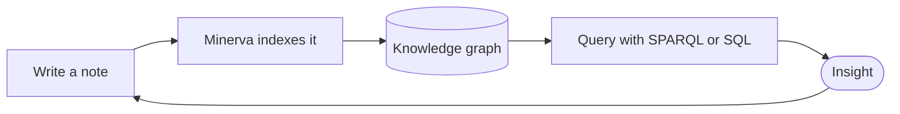

# Diagrams and Embeds

Some ideas are easier drawn than written. Minerva renders **Mermaid** diagrams
and embeds video inline, right in your notes.

## Mermaid diagrams

Fence a block as `mermaid` and it renders as a diagram. Flowcharts, sequences,
state machines, and more:



You already saw one in [[Links That Mean Something]], where a Mermaid graph drew
the shape of an argument. They're plain text, so they diff cleanly and never go
stale as an exported image would.

## Video embeds

Fence a block as `youtube` with a URL on the first line and an optional caption
below. Minerva renders a click-to-open poster — no autoplaying iframe, no tracker
firing as you read:

```youtube
https://www.youtube.com/watch?v=aircAruvnKk
But what is a neural network? — a beautifully visual explainer
```

> [!note] Offline-friendly
> Everything in this thoughtbase renders without a network connection. The video
> poster only reaches out — to *your* browser — when you deliberately click it.

---

Next: [[Sources and Citations]] → · back to [[Start Here]]
