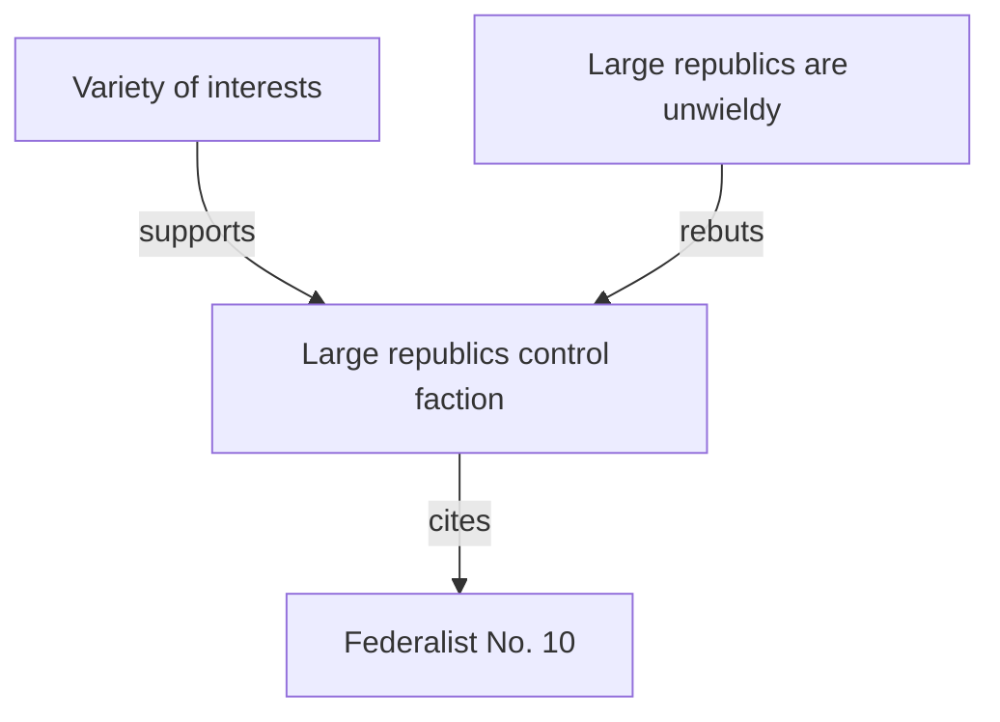

# Links That Mean Something

In most tools a link is just a jump. In Minerva a link is an **edge in the graph**
— and you can say what *kind* of edge it is.

## Plain wiki-links

Wrap a note's name in double brackets: `[[Writing Notes]]` → [[Writing Notes]].
You can change the display text with a pipe — `[[Writing Notes|go write something]]`
renders as [[Writing Notes|go write something]] — and point at a heading with
`[[Writing Notes#Callouts]]`.

## Typed links: say what you mean

Put a `type::` in front of the target and the link carries meaning into the graph:

- `[[supports::Some Claim]]` — evidence for a claim
- `[[rebuts::Some Claim]]` — evidence against
- `[[depends-on::Another Note]]` — this can't stand without that
- `[[expands::Another Note]]` — this elaborates that
- `[[supersedes::Old Note]]` — this replaces that
- `[[related-to::Another Note]]` — a soft association

This lesson [[depends-on::Writing Notes]] and [[related-to::The Knowledge Graph]] —
those are real typed edges you'll be able to query in a moment.

## A mini argument you can trace

We've planted a small argument in the `arguments/` folder. Follow it:

- **Claim:** [[Large republics control faction]]
- **supports →** [[Variety of interests]]
- **rebuts →** [[Large republics are unwieldy]]

Here's the shape of it (see [[Diagrams and Embeds]] for how this diagram is made):

Open [[Large republics control faction]] and trace the edges yourself — then see
the very same argument as formal graph objects in [[Structured Reasoning]].

There are two more typed links — `cite::` and `quote::` — for pointing at
external sources. Those get their own lesson: [[Sources and Citations]].

---

Next: [[Tags and Organization]] → · back to [[Start Here]]
