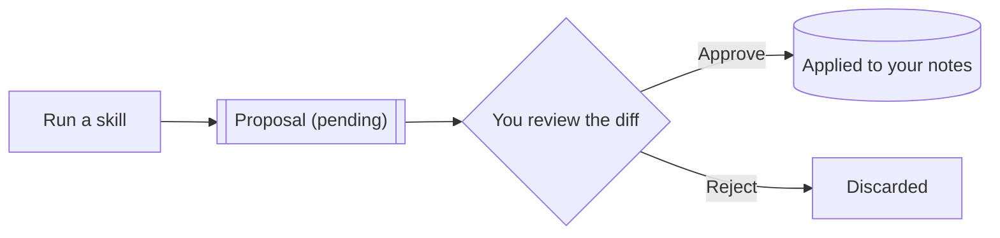

# The AI Proposes, You Confirm

This is the most important design decision in Minerva, so it gets its own lesson:

> **The LLM proposes. The human confirms.**

AI output is *evidence to be evaluated*, never an authoritative update to your
knowledge. Every AI-originated change to your notes or graph is filed as a
**proposal** and applied only when **you** approve it.

## How the flow works

1. A skill (from [[Tools for Thought]]) produces a **pending proposal** — nothing
   has changed yet.
2. You review it in a **diff view**: old on one side, suggested on the other.
3. One keystroke **approves** (and it's applied) or **rejects** (and it's gone).
4. Ignore it and it simply expires. Silence is not consent.

## Why it's built this way

A knowledge base you can't trust is worse than none. By making every AI write
pass through your judgment, Minerva stays *yours* — the graph only ever contains
what you vouched for. The AI is a fast, tireless research assistant; you remain
the editor-in-chief.

> [!tip] Try it
> Go back to [[Tools for Thought]], run a skill on a note, and this time watch for
> the proposal to appear. Approve or reject it and notice that *you* made the call.

---

Next: [[Structured Reasoning]] → · back to [[Start Here]]
